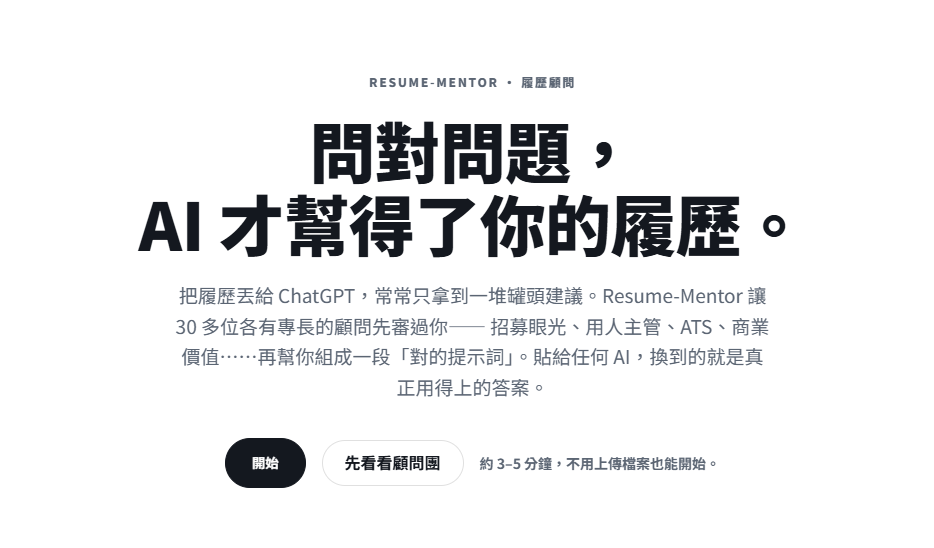

# Resume-Mentor

> **履歷不是拿來寫的，是拿來挖掘的。**
> Most resume tools just format. Resume-Mentor digs out the real reason you deserve the offer.

**30+ 位 AI 顧問** · **69 個職涯技能** · **不編造守門人** · **全程繁體中文**



---

## 它解決什麼問題

大部分履歷工具都在幫你「排版」。但真正卡住你的，從來不是版型：

- **「我明明做了很多事，卻不知道該寫什麼。」**
- **「我工作很多年，但履歷看起來很普通。」**
- **「我知道自己能力不差，卻講不清楚價值。」**
- **「我不知道哪些該留、哪些該刪。」**
- **「每投一個職位，就要重寫一次履歷。」**

問題往往不在履歷，而在於——**你不知道自己有多厲害。**

Resume-Mentor 是一位 AI 履歷導師。它不會一開始就叫你上傳履歷、改幾個字，而是先透過一連串**反問、挑戰與深度挖掘**，幫你找到真正值得被錄取的理由，最後才產出履歷。

---

## 30 秒看懂怎麼運作

| 步驟 | 在做什麼 |
| --- | --- |
| **① 認識你** | 不問「你的工作是什麼」，而問「你最成功的專案是什麼、幫公司創造過什麼價值」。 |
| **② 顧問團挑戰** | 30+ 位顧問各看一個你看不到的盲點，持續追問：結果呢？數據呢？影響呢？ |
| **③ 產出 Career Pack** | 把挖掘出的價值，產生一段可直接複製、貼給任何 AI 的高品質提示詞。 |


---

## 為什麼不一樣

| | 一般履歷產生器 | **Resume-Mentor** |
| --- | --- | --- |
| 核心做法 | 幫你排版、改幾個字 | **反問挖掘**你真正的價值 |
| 把關 | 一個 AI 跑一遍 | **30+ 顧問團**多角度交叉挑戰 |
| 對空泛內容 | 照單全收 | 毒舌挑刺者 + 證據官**逐句追問數據** |
| 防杜撰 | 無 | **不編造守門人**：缺證據就標記待補 |
| 產出 | 一份履歷 | 一整套 **Career Pack**（履歷／面試／LinkedIn／職涯） |
| 語言 | 多為英文工具 | **全程繁體中文** |

---

## 顧問團（節選）

你的履歷不會只經過一個 AI，而是經過一整個顧問團。每一位只負責戳一個你看不到的盲點：

| 顧問 | 他會問你什麼 |
| --- | --- |
| **招募專員** | 10 秒掃描——你最強的成就，第一眼看得到嗎？ |
| **用人主管** | 你的經歷真的符合這個職位嗎？面試會被追問哪裡？ |
| **履歷篩選系統（ATS）** | 格式與關鍵字，篩選系統讀得到嗎？ |
| **商業價值官（CEO）** | 你的工作，幫公司賺到、省到或避開了多少？ |
| **毒舌挑刺者** | 哪些內容太空泛、沒證據、會在面試壓力下垮掉？ |
| **證據官** | 每一句成就，數據呢？範圍呢？你個人到底做了什麼？ |
| **不編造守門人** | 底線最硬的一關：缺證據就標記待補，絕不替你發明。 |

> 完整 30 位顧問依「核心 / 履歷 / 把關 / 面試 / 主管視角 / 領域專家 / 個人品牌 / 職涯成長」分組，
> 涵蓋產品總監、工程主管、設計總監、法遵、AML、KYC、獵頭、談薪、升遷等視角。

---

## 技能庫

底層是 **69 個結構化職涯技能**，每個技能都遵循同一份 Schema
（`Goal / Input / Output / Challenge Rules / Review Rules / Success Criteria`），可單獨組合、驗證、進化：

| 領域 | 代表技能 |
| --- | --- |
| **履歷** | 成就挖掘、履歷改寫、一頁式／兩頁式、量化重建、項目優化 |
| **ATS / 對齊** | ATS 可讀性檢查、JD 匹配、關鍵字落差、技能段優化 |
| **面試** | STAR 回答、自我介紹、失敗故事、行為面試演練、模擬面試評分 |
| **LinkedIn** | 標題、About、經歷、精選、招募者搜尋優化 |
| **職涯** | 職涯定位、職涯落差、轉職敘事、升遷論述、Offer 比較、求職策略 |
| **領域專屬** | PM／工程／設計／創業者／Compliance／AML／KYC 履歷 |
| **護欄** | 不編造守門人、證據請求、偏誤檢查 |

---

## 最後你會得到什麼

不只是一份履歷，而是一整套 **Career Pack**：

```text
career-pack/
├── ATS Resume          可被篩選系統辨識的履歷
├── Executive Resume    高階／主管版履歷
├── Startup Resume      新創取向履歷
├── LinkedIn Profile    LinkedIn 個人檔案
├── Self Introduction   30 秒 / 1 分鐘 / 3 分鐘自我介紹
├── Interview Guide     面試準備指南
├── STAR Stories        行為面試故事庫
├── Cover Letter        客製求職信
├── Career Roadmap      3／5／10 年職涯路線
└── Recruiter Feedback  招募者視角回饋
```

---

## 適合誰

| 對象 | Resume-Mentor 幫你 |
| --- | --- |
| **產品經理** | 把專案轉換成商業價值 |
| **軟體工程師** | 不只展示技術，更展示影響力 |
| **設計師** | 展現思考能力與決策能力 |
| **Compliance / AML / KYC** | 讓專業經驗更容易被理解 |
| **營運與專案管理** | 把看不見的價值量化呈現 |
| **轉職者** | 找到過去經驗與未來職位的連結 |

---

## Roadmap

- [x] AI 履歷導師（反問挖掘 + 顧問團挑戰 + 產出提示詞）
- [x] 69 個結構化職涯技能庫
- [ ] 履歷產生器（站內直接出結果）
- [ ] LinkedIn 優化
- [ ] 模擬面試 / STAR 故事生成
- [ ] 職涯診斷
- [ ] 個人作品集 / 個人網站產生器
- [ ] 薪資談判教練
- [ ] AI Career Copilot

---

## 我們相信

履歷不是一份文件，而是一個人的職涯縮影。

大部分人缺的不是模板，而是**有人願意幫他問對問題**。

下一份工作，未必是因為你的履歷比較漂亮——
而更可能是因為，你終於知道**該怎麼說出自己的價值。**
